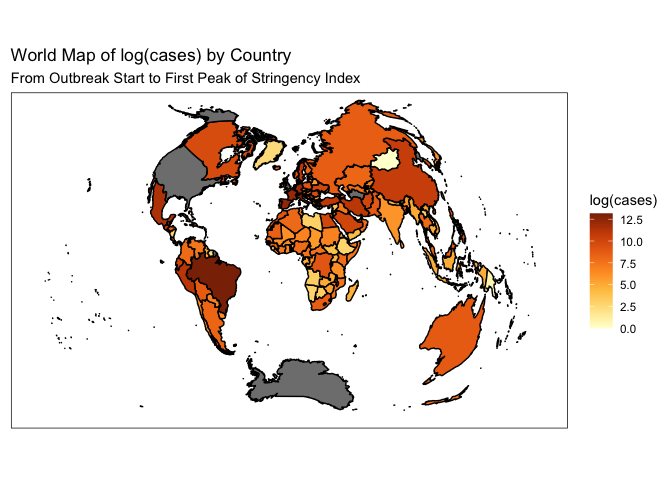
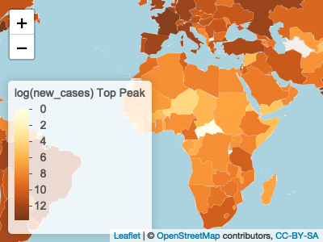

<!-- README.md is generated from README.Rmd. Please edit that file -->

# covidviz

<!-- badges: start -->
<!-- badges: end -->

The goal of covidviz is to provide the user with a set of functions that
perform some non-trivial data wrangling and produce plots as results on
the [OWID COVID
dataset](https://ourworldindata.org/coronavirus-source-data).

## Installation

You can install the development version of covidviz from
[GitHub](https://github.com/) with:

``` r
# install.packages("devtools")
devtools::install_github("tomzhang255/covidviz")
```

## Example

This is an example query:

``` r
library(covidviz)

query1(plot_type = "static", fill = "cases", log_scale = TRUE, projection = "globular")
```



Plot outputs can be dynamic as well:

``` r
query3(plot_type = "dynamic", log_scale = TRUE)
#> Loading required package: sp
```



TODO devtools::build_readme()
